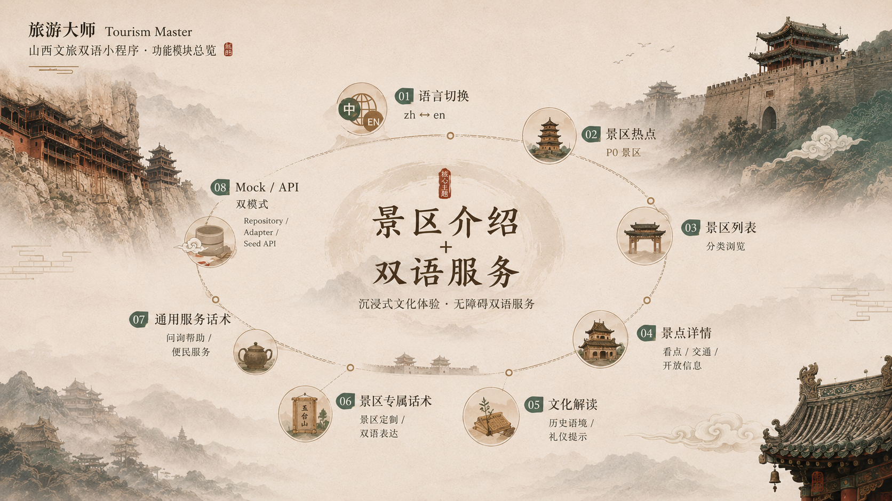

<div align="center">

# Tourism Master · 山西文旅双语小程序

**少做通用 OTA，把空间留给景区介绍与跨文化双语服务**

面向入境游客与中文用户，提供山西重点景区介绍、文化解读与中英双语服务话术，降低跨文化旅游中的信息理解与现场沟通成本。

</div>

<p align="center">
  
</p>

<p align="center">
  
  
  
  
  <a href="https://github.com/Aafff623/tourism-master/stargazers"></a>
</p>

<p align="center">
  <a href="#为什么需要本系统">为什么</a> ·
  <a href="#功能">功能</a> ·
  <a href="#演示">演示</a> ·
  <a href="#快速开始">快速开始</a> ·
  <a href="#架构">架构</a> ·
  <a href="#路线图">路线图</a> ·
  <a href="#文档">文档</a> ·
  <a href="#license">License</a>
</p>

---

## 为什么需要本系统

入境游客在山西景区游览时，通常会遇到以下信息与沟通障碍：

- 景区介绍与导览内容以中文为主，英文信息分布零散或缺失；
- 礼仪、历史语境与文化禁忌缺少易理解的跨文化表达；
- 购票问询、路线咨询与应急求助缺少可复用的中英对照话术；
- 通用旅游应用更关注交易与行程，对景区文化理解的支持相对有限。

Tourism Master 因此将产品主线收敛为：**景区介绍、文化解读与双语服务**。

| 能力 | 产品职责 |
|---|---|
| 景区介绍 | 列表与详情：名称、简介、看点、开放与交通概要 |
| 语言偏好 | 全局 `zh` ↔ `en`；界面文案与内容字段同步切换 |
| 文化解读 | 面向入境游客的礼仪、历史语境与参观提示 |
| 双语服务 | 通用服务话术与景区专属话术 |
| 首页热点 | 以景区热点进入主线，承接首批推荐景区 |
| 数据接入 | 模式 A 本地 Mock 可独立演示；模式 B 后端 Seed 与查询 API 已贯通 |

---

## 功能

<p align="center">
  
</p>

| 功能 | 说明 |
|---|---|
| **全局双语切换** | 支持中文与英文切换，界面文案和景区内容字段同步更新 |
| **景区热点与列表** | 首批覆盖云冈石窟、五台山、平遥古城、晋祠、黄河壶口瀑布（山西侧）与悬空寺 |
| **景点详情** | 展示简介、核心看点、开放与票价说明、交通概要和参观提示 |
| **文化解读** | 从历史语境、参观礼仪和跨文化差异等角度补充景区背景 |
| **景区专属话术** | 根据具体景区提供可直接使用的中英双语表达 |
| **通用服务话术** | 覆盖购票问询、路线咨询、礼仪提示和应急求助等常见场景 |
| **双模式数据接入** | 支持本地 Mock 独立演示，并可切换后端查询 API |

> **业务边界：** 当前不覆盖真实支付、库存核销、完整行程规划、日韩等多语言、语音讲解、AR 或深度地图。产品主线保持为景区介绍与双语服务。

---

## 演示

### 推荐演示路径

```
切换语言 → 首页景区热点 → 进入详情 → 阅读文化解读 / 专属话术
  → 服务页浏览通用话术（主链路无需登录）
```

动态字段（开放时间、票价等）带 **UNVERIFIED** 免责声明，避免将演示数据误解为实时官方信息。

### Showcase

山西主题小程序的真机与管理端截图将在应用启动、内容替换和视觉验收完成后补充，本节暂时保留展示位。

<!--
后续建议使用三列相册：

1. 首页 / 景区热点
2. 景区详情 / 文化解读
3. 双语服务 / 管理端表单
-->

<details>
<summary>查看原始模板界面参考</summary>

> 以下截图仅用于说明现有工程骨架与基础交互，不代表 Tourism Master 的最终视觉与山西正式内容。

| 管理端登录 | 小程序首页 | 文化遗产列表 |
|---|---|---|
| [查看截图](images/1.png) | [查看截图](images/shortcut-20250727-095547.png) | [查看截图](images/shortcut-20250727-095606.png) |

更多参考截图见 [`images/`](images/)。

</details>

### 首批景区（Mock / Seed）

| Slug | 景区 |
|---|---|
| `yungang-grottoes` | 云冈石窟 |
| `wutai-mountain` | 五台山 |
| `pingyao-ancient-city` | 平遥古城 |
| `jinci-temple` | 晋祠 |
| `hukou-waterfall` | 黄河壶口瀑布（山西侧） |
| `xuankong-temple` | 悬空寺 |

---

## 快速开始

### 前置环境

| 组件 | 版本建议 | 备注 |
|---|---|---|
| JDK | 8+ | 后端 Spring Boot |
| Node.js | 18+ | 管理端 / 小程序工具链 |
| Maven | 3.6+ | 后端构建 |
| MySQL | 8 | 后端库 |
| Redis | 任意近期 | 会话 / 缓存 |
| HBuilderX | 近期版 | 打开 `tourism_weapp` |
| 微信开发者工具 | 近期版 | 小程序预览 |

### 管理端（`tourism_admin`）

```bash
git clone https://github.com/Aafff623/tourism-master.git
cd tourism-master/tourism_admin
pnpm install   # 或 npm / yarn
pnpm dev
```

### 后端（`tourism_api`）

1. MySQL 8 + Redis（见 [`tourism_api/sql/README.md`](tourism_api/sql/README.md)）  
2. 按该 README **依序导入** `00` → `01`（Snowy v2.0.0 框架）→ `02`（biz_spot）→ Wave2 Seed → `03`（业务空表）→ `04`（`sys_resource.visible` 补丁）  
3. **JDK 8** 下：`tourism_api` → `mvn clean install -DskipTests`，再进入 `snowy-web-app` 执行 `mvn spring-boot:run`（端口 **86**）  
4. 管理端默认账号：**superAdmin** / **123456**

库名与账号见：`tourism_api/snowy-web-app/src/main/resources/application.properties`（本地示例，勿提交真实生产密钥）。

本机联调阻塞与调研记录：[`docs/output/reports/local-backend-bootstrap/`](docs/output/reports/local-backend-bootstrap/)。

### 小程序（`tourism_weapp`）

用 HBuilderX 打开 `tourism_weapp`，依赖就绪后运行到微信开发者工具预览。

模式 A 下景区主链路走本地 Mock Repository，可不启后端即可演示双语浏览；订票 / 评论仍走原 API 鉴权。

<details>
<summary>新成员阅读顺序</summary>

| 顺序 | 路径 | 目的 |
|---|---|---|
| 1 | `README.md` | 定位、跑起来、边界 |
| 2 | `CONTEXT.md` · `CONTEXT-MAP.md` | 术语与多端地图 |
| 3 | `AGENTS.md` · `CLAUDE.md` | 任务流与 Agent 纪律 |
| 4 | `docs/output/reports/shanxi-bilingual-mvp/prd.md` | 产品验收真相源 |
| 5 | `docs/adr/0001-bilingual-field-model.md` | 双语字段与 `slug` 导航 |
| 6 | 对应端源码 + `docs/contexts/*/CONTEXT.md` | 实施 |

</details>

---

## 架构

<p align="center">
  
</p>

- **`tourism_weapp`**：UniApp 小程序；Locale 切换、景区浏览、Mock Repository / API Adapter；订票与评论沿用 Token 鉴权
- **`tourism_admin`**：Vue3 管理端；景区双语内容维护
- **`tourism_api`**：Spring Boot / Snowy 后端；MyBatis-Plus、Sa-Token、MySQL 8、Redis；模式 B 提供 Seed 与查询 API
- **数据路径**：模式 A 本地 Mock 可独立演示；模式 B 经 API Adapter 读取后端数据

### 技术栈

<p align="center">
  
</p>

| 层级 | 技术 | 路径 |
|---|---|---|
| 用户端 | UniApp（Vue）、微信小程序 | `tourism_weapp/` |
| 管理端 | Vue3 · Vite · Ant Design Vue · TypeScript | `tourism_admin/` |
| 后端 | Spring Boot 2.5 · MyBatis-Plus · Sa-Token · MySQL 8 · Redis | `tourism_api/` |

### 游客主链路

<p align="center">
  
</p>

**实现要点：**

- 导航键使用 `slug`（ADR-0001）；双语成对字段经 Adapter 输出当前 Locale 的 ViewModel
- 游客核心浏览链路免登录；订票与评论无 Token 时行为与模板一致
- 动态字段标注 **UNVERIFIED**；密钥与本地 DB / Redis / 微信配置不入库

### 目录结构

<p align="center">
  
</p>

---

## 路线图

| 阶段 | 状态 | 说明 |
|---|:---:|---|
| Wave 0 仓库资产 / 调研 / ADR | ✅ | docs 骨架、Mock 调研包、ADR-0001 |
| Wave 1 小程序可演示闭环 | ✅ | 语言壳、Mock、列表详情、热点、服务话术、回归 |
| Wave 2 三端数据贯通 | ✅ | API Seed、小程序切 API、管理端双语表单 |
| 概况 / 遗产页（SD-15） | 🔜 | 另开任务 |
| Wave 3 内容运营（模式 C） | ⚪ | 需独立 ADR / PRD |

推进节奏见 [`docs/output/reports/shanxi-bilingual-mvp/implementation-roadmap.md`](docs/output/reports/shanxi-bilingual-mvp/implementation-roadmap.md)。

---

## 文档

| 文档 | 说明 |
|---|---|
| [`CONTEXT.md`](CONTEXT.md) | 产品域事实、术语、约束 |
| [`CONTEXT-MAP.md`](CONTEXT-MAP.md) | 多端上下文地图 |
| [`AGENTS.md`](AGENTS.md) · [`CLAUDE.md`](CLAUDE.md) | Agent 入口与维护协议 |
| [`docs/README.md`](docs/README.md) | 文档资产索引 |
| [`docs/output/reports/shanxi-bilingual-mvp/prd.md`](docs/output/reports/shanxi-bilingual-mvp/prd.md) | 产品 PRD（approved） |
| [`docs/adr/0001-bilingual-field-model.md`](docs/adr/0001-bilingual-field-model.md) | 双语字段与导航键 |
| [`docs/contexts/`](docs/contexts/) | weapp / admin / api 分端 CONTEXT |
| [`docs/output/reports/readme-diagrams/readme-diagram-brief.md`](docs/output/reports/readme-diagrams/readme-diagram-brief.md) | README 配图生成说明 |

任务流：GitHub Issues + `docs/output/handoff/`；完结归档见 `docs/output/*/archive/`。

---

## 项目来源与说明

本项目基于既有的 Spring Boot + Vue3 + UniApp 旅游系统工程进行二次开发。原工程提供管理端、小程序端、后端以及订票、评论等基础能力；Tourism Master 在此基础上重新聚焦山西景区内容、跨文化解读与中英双语服务。

原始模板仅作为工程基础，不代表本项目最终的产品定位与正式展示内容。

---

## License

见根目录 [`LICENSE`](LICENSE)（随模板）。
